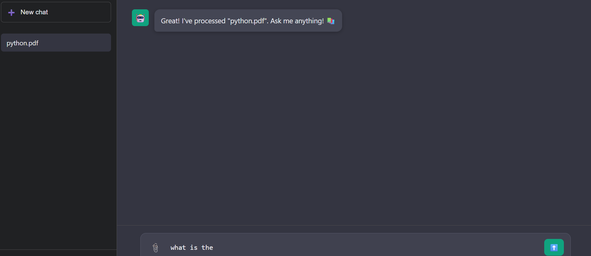
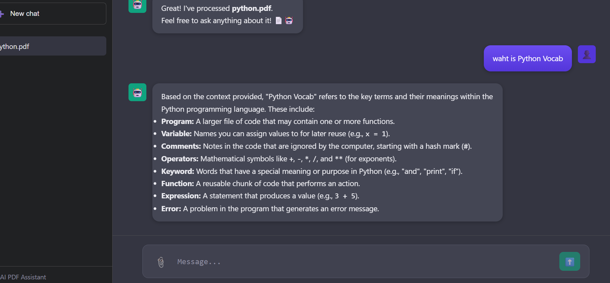

# 📘 PDF Q&A — Gemini RAG (Local)



A simple **Retrieve-and-Generate (RAG)** system using:

✅ Google Gemini (google-genai)
✅ FAISS / SQLite / Chroma vector database
✅ FastAPI backend
✅ Upload PDF → Chunk → Embed → Store → Ask Questions → Get Answers
✅ Supports summarization, session history, and secure API usage

---

# 🚀 1. Setup (Windows / Mac / Linux)

### 1️⃣ Clone the project

```
git clone https://github.com/Shambhu7714/Q-A_Chatbot.git
cd pdf_gemini_rag
```

---

# 🐍 2. Create & activate virtual environment

### Windows (PowerShell):

```
python -m venv venv
venv\Scripts\activate
```

### Linux/Mac:

```
python3 -m venv venv
source venv/bin/activate
```

---

# 📦 3. Install dependencies

```
pip install --upgrade pip
pip install -r requirements.txt
```

If FAISS fails on Windows:

```
pip install chromadb
```

---

# 🔑 4. Add your Gemini API key

Create a `.env` file in project root:

```
GOOGLE_API_KEY=your_key_here
```

---

# 🔍 5. Verify Embedding Works

(Optional but recommended)

```
python test_embed.py
```

Expected:

```
OK embed dims: 768
EMBED TEST OK: True
```

If this fails → embeddings won’t work → send output to debug.

---

# 📄 6. Index a PDF

Place your PDF in project folder (example: `Care_Helth_plains.pdf`).

Then run:

```
python index_pdf_simple.py
```

Expected:

```
Indexed chunks: <number>
```

This step:

* Extracts text from PDF
* Cleans & chunks it
* Generates embeddings
* Stores them in FAISS or Chroma

---

# ❓ 7. Ask Questions (CLI Test)

```

python query_simple.py
```

Expected:

```
Retrieved: [0.88, 0.77, ...]
ANSWER:
 <your answer here>
```

---

# 🌐 8. Start FastAPI Server

```
uvicorn app:app --reload --port 8000
```

Open browser:

👉 [http://localhost:8000/](http://localhost:8000/)

You will see:

* Upload PDF
* Ask Questions
* Summarize
* Session ID
* History

---

# 🔧 9. Debug Endpoints (Important for fixing issues)

### Available models:

```
GET /debug/models
```

### Stored chunks:

```
GET /debug/pdf/{pdf_id}/chunks
```

### Stored embeddings:

```
GET /debug/pdf/{pdf_id}/embeddings
```

### Retrieval test:

```
GET /debug/retrieve?pdf_id=<id>&q=your+question
```

---

# 📁 Project Structure (High Level)

```
pdf_gemini_rag/
│
├── app.py                   → FastAPI backend
├── embedding_client.py      → Gemini embed & text generation
├── rag_engine.py            → RAG pipeline (retrieve & generate)
├── vector_store_sqlite.py   → SQLite vector DB (or FAISS/Chroma)
├── index_pdf_simple.py      → CLI PDF indexer
├── query_simple.py          → CLI question tester
├── test_embed.py            → Quick SDK embedding test
│
├── static/                  → Frontend JS
├── templates/               → Frontend HTML (Jinja)
│
├── data/                    → Vector DB (FAISS / Chroma)
├── .env                     → Gemini API key
└── requirements.txt
```

---

# ⚠️ Important Notes

### ✔ Make sure your Gemini generation model is valid

Use only the models listed in:

```
/debug/models
```

Example good models:

* `"models/gemini-pro"`
* `"models/gemini-1.5-pro"`
* `"models/gemini-1.5-flash"`
* `"text-embedding-004"` (embedding model)

### ✔ Do NOT use `"gemini-2.5-pro"` (vision model, no text output)

---

# ❤️ Tips for Better RAG Answers

* Use **chunk size ~800** and **overlap ~100**
* Use FAISS when possible (better local performance)
* Limit retrieval to **top_k = 4–6**
* Keep prompts clean and specific
* If PDF is huge → use staged summarization

---

# ✔ You're Ready!

If anything breaks, run:


and share the output — that instantly reveals the real issue.

---
